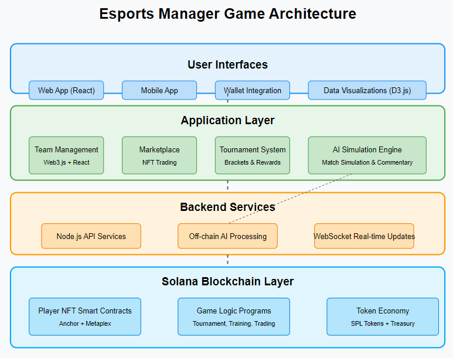

# Esport Dream League

## Architecture Plan


### Project Plan
1. Game Concept Overview
Esports Manager is a blockchain-based simulation game where players manage virtual esports teams and compete in tournaments. The game leverages Solana blockchain for its fast transactions and low fees, with AI-driven match simulations as the core gameplay mechanic.
Key Features:

Player NFTs with unique attributes and stats
Team management and strategic decision-making
AI-driven match simulations based on NFT metadata
Tournament system with rewards
Training and development system
Player marketplace
Governance token economy

2. Technical Architecture
2.1 Blockchain Layer (Solana)
Player NFT Smart Contracts:

Implemented using Anchor framework and Metaplex standards
Each NFT contains:

Base attributes (skill level, reaction time, game knowledge)
Specialized abilities (champion/hero proficiency, strategy adaptability)
Experience and improvement potential
Historical performance data
Visual representation
Rarity traits


### Game Logic Programs:

Team management
Tournament organization and execution
Match result verification
Training and development system
Reward distribution

### Token Economy:

SPL token for in-game currency (ESPM Token)
Staking mechanisms for team ownership
Tournament entry fees and prize pools
Governance system for game parameters

2.2 Backend Services (Off-chain)
AI Simulation Engine:

Neural network trained on player metadata patterns
Simulate matches based on team composition and strategies
Generate detailed play-by-play commentary
Analyze performance and produce highlights
Update player stats based on performance

### Node.js API Services:

Handle complex queries and data aggregation
User account management
Tournament management
Historical statistics and leaderboards

### Real-time Updates:

WebSocket server for live match updates
Notification system for important events
Live marketplace activity

### Data Storage:

Redis for caching frequently accessed data
MongoDB for historical match data and analytics
IPFS for extended metadata storage

2.3 Application Layer
Team Management Module:

Draft and recruit players
Set team strategies and compositions
Manage training regimens
Monitor team chemistry and performance

### Marketplace:

Buy/sell/trade player NFTs
Auction house for rare players
Scout upcoming talent
Contract negotiations

### Tournament System:

Regular season matches
Special tournaments with entry requirements
Custom tournament creation
Brackets and elimination systems

### AI Simulation Visualization:

Match playback system
Real-time simulation tracking
Highlight generation
Performance analytics

2.4 User Interfaces
Web Application:

React.js/Next.js frontend with TypeScript
TailwindCSS for responsive design
D3.js for data visualization
Three.js for 3D elements (optional)

### Mobile App:

React Native application
Touch-optimized interface
Push notifications for match results

### Wallet Integration:

Phantom, Solflare wallet support
Simplified onboarding for crypto newcomers
Custodial options for mainstream adoption

3. Development Roadmap
Phase 1: Core Development (3-4 months)

Smart contract architecture design and implementation
Basic NFT player system
Simple AI simulation model
Core web interface
Basic marketplace functionality

Phase 2: Enhanced Features (2-3 months)

Advanced AI simulation engine
Tournament system implementation
Training and development mechanics
Enhanced visualization system
Mobile app development

Phase 3: Economy & Scaling (2-3 months)

Full token economy implementation
Governance system
Advanced marketplace features
Performance optimization
Security audits

Phase 4: Community & Growth (Ongoing)

Community tournaments
Partnerships with esports brands
Enhanced graphics and visuals
New game modes and features

4. AI Implementation Details
4.1 Player NFT Metadata Structure
```bash
jsonCopy{
  "player": {
    "name": "CyberShot99",
    "position": "Mid Laner",
    "specialization": "Assassins",
    "baseStats": {
      "mechanical": 85,
      "gameKnowledge": 78,
      "teamCommunication": 70,
      "adaptability": 82,
      "consistency": 76
    },
    "specialAbilities": [
      {"name": "Clutch Factor", "value": 88},
      {"name": "Map Awareness", "value": 81}
    ],
    "gameSpecific": {
      "championPool": [
        {"champion": "Zed", "proficiency": 92},
        {"champion": "Akali", "proficiency": 89},
        {"champion": "Syndra", "proficiency": 76}
      ]
    },
    "experience": 2450,
    "potential": 92,
    "form": 88,
    "performanceHistory": [
      // Recent match results and individual performance
    ]
  },
  "visual": {
    "avatar": "ipfs://QmHash...",
    "rarity": "Epic",
    "customizations": {
      // Visual customization options
    }
  }
}
```
4.2 AI Simulation Process

Pre-match Analysis:

Team composition evaluation
Strategy matching against opponent
Player synergy calculation


Match Simulation:

Turn-based or real-time simulation (depending on esport type)
Key moment generation
Player performance based on metadata + situational modifiers
Critical play opportunities based on player "clutch" abilities


Results Processing:

Match outcome determination
Player stat adjustments
Experience and form updates
Narrative generation


Visualization:

Text-based play-by-play
2D visualization of key moments
Statistical summary and graphs
Highlight identification


5. User Experience Flow

Onboarding:

Wallet connection
Tutorial system
Starter pack (basic team)


Team Building:

Scout marketplace for players
Draft system for new players
Team strategy setting


Training & Development:

Allocate training resources
Specific skill development
Coaching and mentorship


Competition:

Regular season matches
Tournament participation
Watch AI simulations
Receive rewards based on performance


Management:

Player trading
Strategy adaptation
Team chemistry management
Financial resource allocation


6. Business Model

Primary Revenue Streams:

Initial NFT sales (starter packs)
Marketplace fees (% of trades)
Tournament entry fees
Premium features


Token Utility:

Governance rights
Staking rewards
Tournament prizes
Training boosts


Sustainability Mechanisms:

Treasury for ongoing development
Player retirement/new generation system
Seasonal updates and new content


7. Technical Stack Details
Frontend:

React/Next.js with TypeScript
Redux for state management
TailwindCSS for styling
D3.js for data visualization
Ethers.js/Web3.js for blockchain interaction

Backend:

Node.js/Express for API
Socket.io for real-time updates
TensorFlow/PyTorch for AI models (with Node.js integration)
Redis for caching
MongoDB for analytics data

Blockchain:

Solana (Anchor framework)
Metaplex for NFT standards
SPL tokens for in-game currency

DevOps:

AWS/GCP for hosting
CI/CD pipeline with GitHub Actions
Monitoring with Datadog or similar